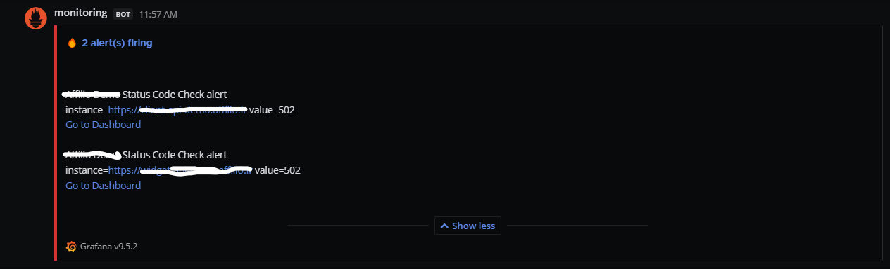
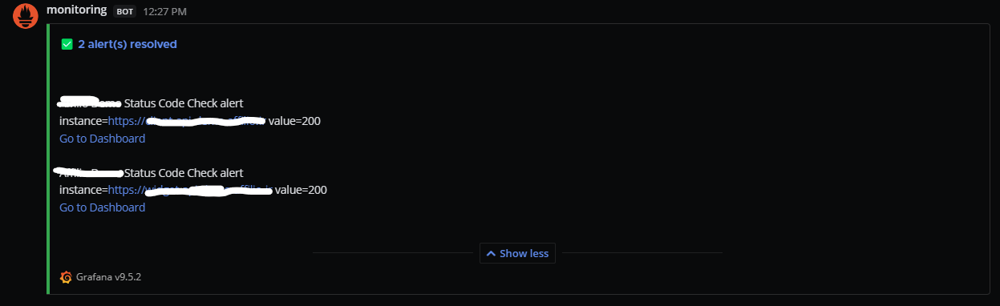
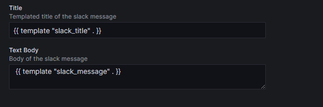
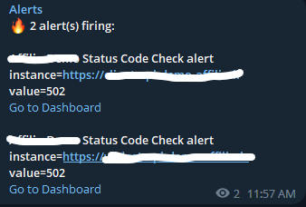
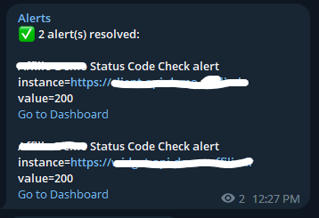
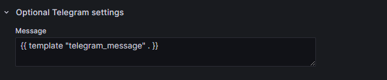

# Grafana Alert Template: Your Savior from the Depths of Hell 🚀

Are you tired of the torment and despair caused by Grafana's lack of documentation for alerting? Fear not, for I have descended from the heavens to rescue you! Introducing the **Grafana Alert Template**, your ultimate salvation in the realm of alerting.

With this easy-to-use template, you'll experience a euphoric escape from the fiery pits of confusion. Say goodbye to countless hours of frustration and confusion, and embrace the beauty of simplicity.

just make 2 templates for slack and telegram in your grafana with these and you will see how it feels to walk among Gods.

## Features:
- **Slack, Mattermost, Rocket Chat Integration**: Connect with your favorite messaging platforms and receive alerts directly to your team's channels. Stay informed and take swift action!
- **Telegram Integration**: Join the Telegram revolution and receive alerts in style. It's time to level up your alert game and impress your peers!


### How to Use:
there are images here which show how the alerts look if setup correctly.

you should use ( Reduce + Treshold ) for you alerts, then in each alert in setting number 4 which is ( Add details for your alert rule) add a new annotation named summary, and that will be sent with your alert.

this is a sample text you coulde use: `instance={{ index $labels "instance" }} value={{ index $values "B" }}`

### Alert Templates
                                            👇🏼 Slack - RocketChat - MatterMost 👇🏼
<div align="center">
    
    
    
</div>

```
{{ define "slack_title" }}
{{ if gt (len .Alerts.Firing) 0 }}🔥 {{ len .Alerts.Firing }} alert(s) firing {{ end }}
{{ if gt (len .Alerts.Resolved) 0 }} ✅ {{ len .Alerts.Resolved }} alert(s) resolved {{ end }}
{{ end }}
{{ define "slack_message" }}
{{ if gt (len .Alerts.Firing) 0 }}
{{ range .Alerts.Firing }} {{ template "slack_alert_firing" .}} {{ end }} {{ end }}
{{ if gt (len .Alerts.Resolved) 0 }}
{{ range .Alerts.Resolved }} {{ template "slack_alert_resolved" .}} {{ end }} {{ end }}
{{ end }}  
{{ define "slack_alert_firing" }}
{{ .Labels.alertname }}
{{ .Annotations.summary }}
<{{ .PanelURL }}|Go to Dashboard>
{{ end }}
{{ define "slack_alert_resolved" }}
{{ .Labels.alertname }}
{{ .Annotations.summary }}
<{{ .PanelURL }}|Go to Dashboard>
{{ end }}
```
                                                     👇🏼 Telegram 👇🏼
<div align="center">
    
    
    
</div>

```
{{ define "telegram_message" }}
{{ if gt (len .Alerts.Firing) 0 }} <b>🔥 {{ len .Alerts.Firing }} alert(s) firing:</b>
{{ range .Alerts.Firing }} {{ template "telegram_alert_firing" .}} {{ end }} {{ end }}
{{ if gt (len .Alerts.Resolved) 0 }} <b>✅ {{ len .Alerts.Resolved }} alert(s) resolved:</b>
{{ range .Alerts.Resolved }} {{ template "telegram_alert_resolved" .}} {{ end }} {{ end }}
{{ end }}
{{ define "telegram_alert_firing" }}
<b>{{ .Labels.alertname }}</b>
<b>{{ index .Annotations "summary" }}</b>
{{ with .PanelURL }}<a href="{{ . }}">Go to Dashboard</a>{{ end }}
{{ end }}
{{ define "telegram_alert_resolved" }}
<b>{{ .Labels.alertname }}</b>
<b>{{ index .Annotations "summary" }}</b>
{{ with .PanelURL }}<a href="{{ . }}">Go to Dashboard</a> {{ end }}
{{ end }}
```
